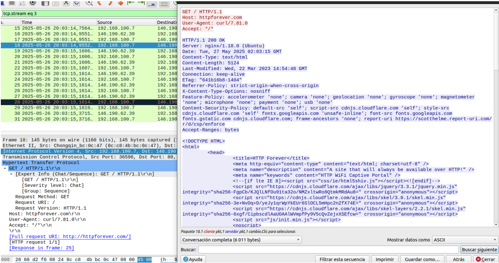
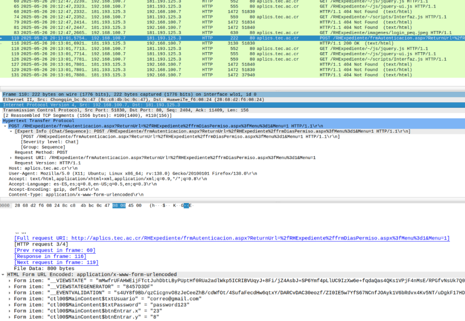
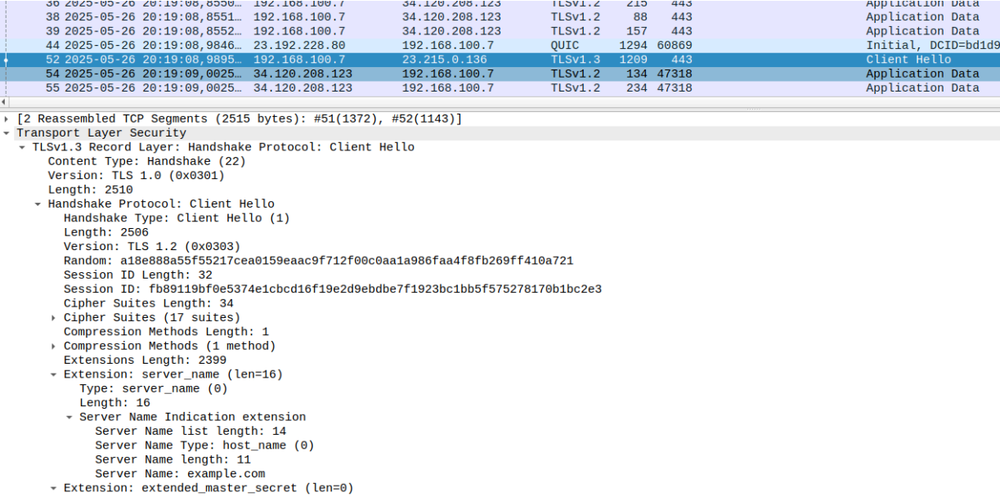
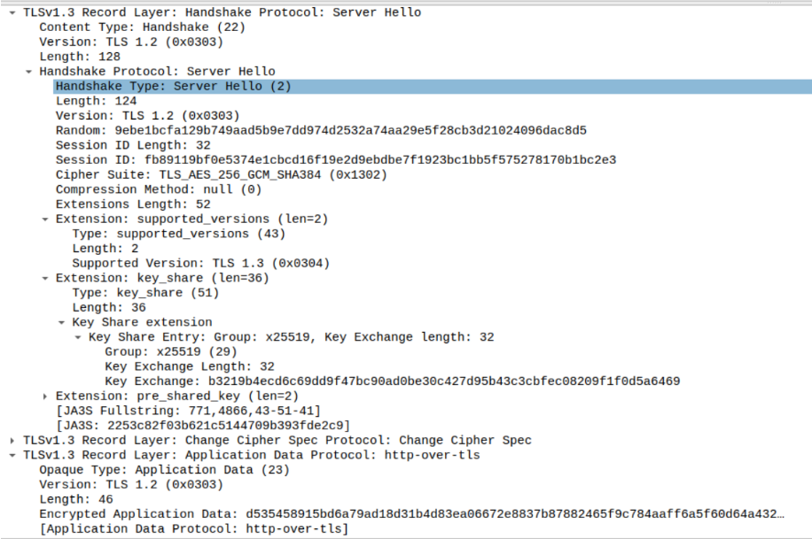
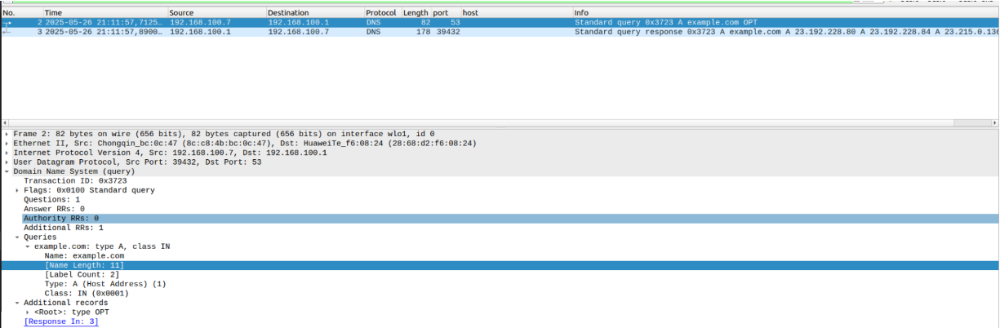
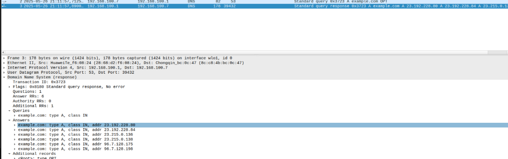
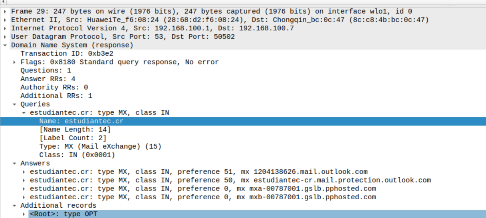

# Network Traffic Analysis with Wireshark: Protocols and Security

## Overview

This laboratory focuses on the analysis of network traffic using **Wireshark** to identify, inspect, and understand the behavior of different network protocols.

---

## Objective

Train in the use of network traffic analysis tools such as Wireshark to identify, inspect, and understand the operation of various protocols, with a focus on detecting unencrypted transmissions and potential vulnerabilities.

---

## 🧰 Tools Used

- **Wireshark** – for graphical inspection and in-depth network analysis

---

## 🧩 Practical Analysis by Protocol

Each section presents the protocol tested, a brief description of the observed traffic, and answers to analysis questions.  
All captures were analyzed using Wireshark, and screenshots are included for each test.

---

### 1. HTTP

**Captured Website:** `http://httpforever.com`

#### Analysis

The HTTP protocol transmits all communication between client and server **in plain text**, including headers, URLs, and HTML content.  
When inspecting the packets, it is possible to clearly observe the `GET` method, request headers, and the full web page content.

> 

But using a website such as: `http://aplics.tec.ac.cr/RHExpediente/frmAutenticacion.aspx?ReturnUrl=/RHExpediente/fr
mDiasPermiso.aspx%3FMenu%3D1&Menu=1`, even user credentials can be intercepted when authentication forms are sent through HTTP.

> 

We see how de email used to access in this website is `correo@gmail.com` with `password123` as password.

#### What sensitive information is transmitted unencrypted?

All transmitted data, such as URLs, headers, cookies, and form data, are visible in plaintext, making it vulnerable to interception by anyone on the same network.

---

### 2. HTTPS

**Captured Website:** `https://example.com`

#### Analysis

During the HTTPS capture, the first packets show a **Client Hello** message sent from the client to the server.  
In this message, the client advertises the **supported TLS versions**, the **available cipher suites**, and includes the **Server Name Indication (SNI)**, which reveals the hostname being accessed.

> 

Next, the **Server Hello** message appears in the capture.  
Here, the server selects:

- The **TLS version** that will be used for the session
- The **cipher suite** for encryption and authentication
- The **key exchange mechanism**, which in this case uses the **x25519** elliptic curve group

> 

After the handshake is completed, all subsequent packets are labeled as **Application Data**, meaning that the content (such as web forms, credentials, or page data) is fully encrypted and cannot be directly inspected in Wireshark.

#### What information can still be observed even when encrypted?

Even though the payload is encrypted, some metadata remains visible in the capture:

- The **server’s IP address**
- The **TLS version** used (e.g., TLS 1.2 or TLS 1.3)
- The **cipher suite** selected for encryption
- The **public key** shared during the handshake for key exchange

This limited visibility allows analysts to identify the destination server and the security parameters of the connection, but not the actual data exchanged between client and server.

---

### 3. DNS

**Command Used:** `dig example.com`

#### Analysis

The `dig` (Domain Information Groper) command is a DNS lookup utility used to query DNS name servers for information about host addresses, mail exchanges, name servers, and related data. It allows users to observe how a domain name is resolved to its corresponding IP address and to analyze the structure of DNS responses.

The DNS capture shows a standard query and response exchange between the client and its configured DNS resolver. The client (`192.168.100.7`) sends a DNS query to the resolver (`192.168.100.1`) over UDP port 53, requesting an A record for the domain `example.com`.

> 

In the response, the resolver returns multiple A records, each containing an IPv4 address associated with the queried domain.

> 

This confirms that the DNS resolution process successfully maps the domain name to its corresponding IP addresses.

A similar test using `dig MX estudiantec.cr` shows how `dig` can request different record types, in this case, MX records (Mail Exchange) that specify the mail servers responsible for handling emails for that domain.

> 

#### Where dows the resolution occur?

The DNS resolution is handled by the local resolver at IP address `192.168.100.1`, whic in this setup corresponds to the default gateway (home router). From the client’s perspective, this device provides the DNS answers.
However, in most cases, the router forwards the queries to external DNS servers (e.g., from the ISP or public providers like Google DNS or Cloudflare).
This forwarding process is not visible in Wireshark because only the packets entering and leaving the client machine were captured.
