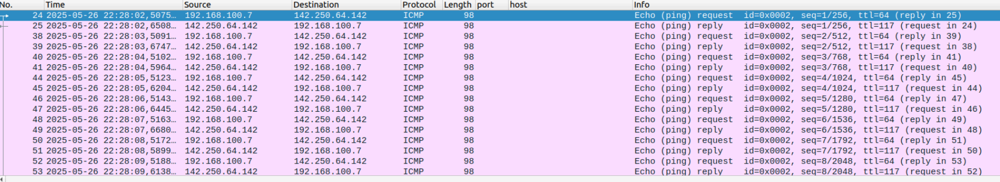

<h1 align="center">🌐 Network Traffic Analysis with Wireshark: Protocols and Security</h1>


## Overview

This laboratory focuses on the analysis of network traffic using **Wireshark** to identify, inspect, and understand the behavior of different network protocols.

---

## Objective

Train in the use of network traffic analysis tools such as Wireshark to identify, inspect, and understand the operation of various protocols, with a focus on detecting unencrypted transmissions and potential vulnerabilities.

---

## Tools Used

- **Wireshark** – for graphical inspection and in-depth network analysis ([Wireshark official website](https://www.wireshark.org))

---

## Table of Contents

Click on any protocol to jump to its analysis section:

1. [HTTP](#1-http)
2. [HTTPS](#2-https)
3. [DNS](#3-dns)
4. [SMTP](#4-smtp)
5. [FTP](#5-ftp)
6. [ICMP](#6-icmp)
7. [SSH](#7-ssh)
8. [Final Analysis and Conclusions](#final-analysis-and-conclusions)

---

## Practical Analysis by Protocol

Each section below presents:

- The objective of the capture
- The traffic behavior observed in Wireshark
- Key security observations and analysis questions

All captures were performed using Wireshark, with screenshots included to illustrate the captured packets.

---

### 1. HTTP

**Captured Website:** `http://httpforever.com`

#### Analysis

The HTTP protocol transmits all communication between client and server **in plain text**, including headers, URLs, and HTML content.  
When inspecting the packets, it is possible to clearly observe the `GET` method, request headers, and the full web page content.

> 

But using a website such as: `http://aplics.tec.ac.cr/RHExpediente/frmAutenticacion.aspx?ReturnUrl=/RHExpediente/fr
mDiasPermiso.aspx%3FMenu%3D1&Menu=1`, even user credentials can be intercepted when authentication forms are sent through HTTP.

> 

We see how de email used to access in this website is `correo@gmail.com` with `password123` as password.

#### What sensitive information is transmitted unencrypted?

All transmitted data, such as URLs, headers, cookies, and form data, are visible in plaintext, making it vulnerable to interception by anyone on the same network.

---

### 2. HTTPS

**Captured Website:** `https://example.com`

#### Analysis

During the HTTPS capture, the first packets show a **Client Hello** message sent from the client to the server.  
In this message, the client advertises the **supported TLS versions**, the **available cipher suites**, and includes the **Server Name Indication (SNI)**, which reveals the hostname being accessed.

> 

Next, the **Server Hello** message appears in the capture.  
Here, the server selects:

- The **TLS version** that will be used for the session
- The **cipher suite** for encryption and authentication
- The **key exchange mechanism**, which in this case uses the **x25519** elliptic curve group

> 

After the handshake is completed, all subsequent packets are labeled as **Application Data**, meaning that the content (such as web forms, credentials, or page data) is fully encrypted and cannot be directly inspected in Wireshark.

#### What information can still be observed even when encrypted?

Even though the payload is encrypted, some metadata remains visible in the capture:

- The **server’s IP address**
- The **TLS version** used (e.g., TLS 1.2 or TLS 1.3)
- The **cipher suite** selected for encryption
- The **public key** shared during the handshake for key exchange

This limited visibility allows analysts to identify the destination server and the security parameters of the connection, but not the actual data exchanged between client and server.

---

### 3. DNS

**Command Used:** `dig example.com`

#### Analysis

The `dig` (Domain Information Groper) command is a DNS lookup utility used to query DNS name servers for information about host addresses, mail exchanges, name servers, and related data. It allows users to observe how a domain name is resolved to its corresponding IP address and to analyze the structure of DNS responses.

The DNS capture shows a standard query and response exchange between the client and its configured DNS resolver. The client (`192.168.100.7`) sends a DNS query to the resolver (`192.168.100.1`) over UDP port 53, requesting an A record for the domain `example.com`.

> 

In the response, the resolver returns multiple A records, each containing an IPv4 address associated with the queried domain.

> 

This confirms that the DNS resolution process successfully maps the domain name to its corresponding IP addresses.

A similar test using `dig MX estudiantec.cr` shows how `dig` can request different record types, in this case, MX records (Mail Exchange) that specify the mail servers responsible for handling emails for that domain.

> 

#### Where dows the resolution occur?

The DNS resolution is handled by the local resolver at IP address `192.168.100.1`, whic in this setup corresponds to the default gateway (home router). From the client’s perspective, this device provides the DNS answers.
However, in most cases, the router forwards the queries to external DNS servers (e.g., from the ISP or public providers like Google DNS or Cloudflare).
This forwarding process is not visible in Wireshark because only the packets entering and leaving the client machine were captured.

---

### 4. SMTP

**Command Used:** `telnet smtp.freesmtpservers.com 25`

#### Analysis

In this test, the Simple Mail Transfer Protocol (SMTP) was analyzed using a manual connection established via **Telnet** on port 25.
This method allows observing the SMTP communication process step-by-step, including how email data is transmitted between the client and the mail server.

> 

Through Wireshark, the entire command sequence can be clearly identified:

- `HELO` - the cliente introduces itself to the mail server
- `MAIL FROM` - specifies the sender's email address
- `RCPT TO` - specifies the recipient's email address
- `DATA` - begins the transmission of the message content, including subject and body.

Each of these commands appears in plain text, revealing the structure of the email exchange.

#### How much information is exposed?

All information transmitted through unencrypted **SMTP (port 25)** is **fully visible** in the packet capture.
This includes:

- The sender and recipient addresses
- The subject line
- The message body content

> 

Because the communication is not protected by encryption, anyone intercepting the traffic could read or modify the email data, making this protocol insecure without the use of **TLS (SMTPS)**.

---

### 5. FTP

**Server Used:** `test.rebex.net`
**Connection Command:** `telnet test.rebex.net 21`

#### Analysis

For this test, the **File Transfer Protocol (FTP)** was analyzed by connecting to a public test server usign **Telnet** on port 21, which is the default control port for FTP connections.

This method makes it possible to manually observe the commands exchanged between the client and the server.

> 

In the Wireshark capture, the authentication process can be clearly seen where the client sends the credentials:

```
Username: demo
Password: password
```

Both are transmitted in plain text, allowing any observer on the same network to intercept them easily. Once authenticated, the client can issue FTP commands such as `LIST`, `RETR` and `STOR` to browse directories and transfer files, all of which also occur without encryption.

#### What vulnerabilities does it present?

The use of unencrypted FTP exposes several critical security risks:

- **Credential theft** - usernames and passwords are transmitted in plain text.
- **Identity spoofing** - attackers can impersonate legitimate users.
- **Unauthorized file access** - data and directory listings can be intercepted or modified during transfer.

- **Integrity compromise** - files may be tampered with since no encryption or checksum validation is enforced.

To mitigate these vulnerabilities, **FTPS (FTP over TLS)** or **SFTP (SSH File Transfer Protocol)** should be used instead of plain FTP.

---

### 6. ICMP

**Target Host:** `google.com`

#### Analysis

The **Internet Control Message Protocol (ICMP)** is used for diagnostic and network testing purposes.  
In this experiment, the `ping` command was executed to send ICMP **Echo Request** packets to `google.com` and observe the replies in Wireshark.

> 

The captured **Echo Request** packets are identified as **Type 8**, indicating they were initiated by the client.  
Each packet includes:

- A **checksum**, used to verify data integrity and detect transmission errors
- A **timestamp**, used to measure the round-trip time
- A **payload of 48 bytes**, used to test latency and packet integrity during transmission

> 

The corresponding **Echo Reply** packets, sent back by the remote host, are labeled as **Type 0**. These responses contain similar fields but also allow Wireshark (and the `ping` utility) to calculate **response time**, which reflects the latency between the client and the target host.

> 

#### What useful information does this protocol provide?

ICMP is primarily used to:

- **Verify host availability** on a network
- **Measure latency** (round-trip time) between source and destination
- **Detect packet loss** and validate message integrity using checksums
- **Assist in diagnosing** network performance or connectivity issues

By analyzing ICMP traffic in Wireshark, network administrators can quickly assess whether communication failures are due to reachability, routing, or latency problems.

---

### 7. SSH

**Server Used:** `test.rebex.net`
**Command Executed:** `ssh demo@test.rebex.net`

#### Analysis

The **Secure Shell (SSH)** protocol was analyzed by connecting to a public test server using the `ssh` command.

SHH operates at the application layer and provides a secure channel over an insecure network through encryption and authentication mechanisms.

In the inicial phase of the session, the client and the server negotiate encryption parameters and agree on supported algorithms. The key exchange is then performed using the **Elliptic Curve Diffie-HEllman (ECDH)** method, ehcih allows both parties to derive a shared secret key without transmitting it over the network.

> 

Once the key exchange is complete, all subsequent communication including authentication, command execution, and data transfer, becomes fully encrypted. In Wireshark, these encrypted packets appear simply as **Encrypted Packet** or **SSH Protocol**, with no visible payload content.

#### Is it possible to see any data from the communication?

No. After the encryption handshake, it is not possible to view or extract any actual data exchanged between the client and server.

The only information visible in Wireshark pertains to the initial negotiation phase, such as:

- Supported encryption and authentication algorithms
- Key exchange methods (e.g., ECDH)
- Protocol version identifiers

Once the session keys are established, all subsequent SSH packets are completely encrypted, protecting both data confidentiality and integrity.

---

## Final Analysis and Conclusions

Throughout this laboratory, various network protocols were captured and analyzed using **Wireshark** to better understand how data is transmitted across different layers of the network stack.  
By comparing unencrypted and encrypted communications, it was possible to clearly observe the differences in **data exposure, confidentiality, and security** among protocols.

Unencrypted protocols such as **HTTP**, **FTP**, and **SMTP** revealed complete message content, including credentials, headers, and body data, directly in the packet captures.  
This demonstrates how legacy or insecure implementations can easily lead to **information leakage** and **unauthorized access** if used without encryption.

On the other hand, protocols implementing encryption, like **HTTPS** and **SSH**, effectively protected user data by encrypting all payloads after their initial handshake.  
Only metadata such as IP addresses, protocol versions, and cipher suites remained visible, which is normal and expected behavior in secure communications.

Meanwhile, diagnostic and infrastructure protocols such as **DNS** and **ICMP** provided valuable insights into network behavior, reachability, and latency. However, they can also reveal sensitive metadata which may be exploited in traffic analysis or reconnaissance attacks.

Overall, this lab reinforces key concepts in **network security and protocol analysis**:

- Encryption is essential to ensure confidentiality and integrity.
- Tools like **Wireshark** are indispensable for understanding network behavior, troubleshooting issues, and identifying vulnerabilities.
- Awareness of protocol design helps network professionals select appropriate tools and configurations to secure modern communication systems.

> **In summary:**  
> Wireshark provides a powerful lens through which to observe the hidden world of network traffic, emphasizing that every unencrypted packet can potentially reveal more than intended.
